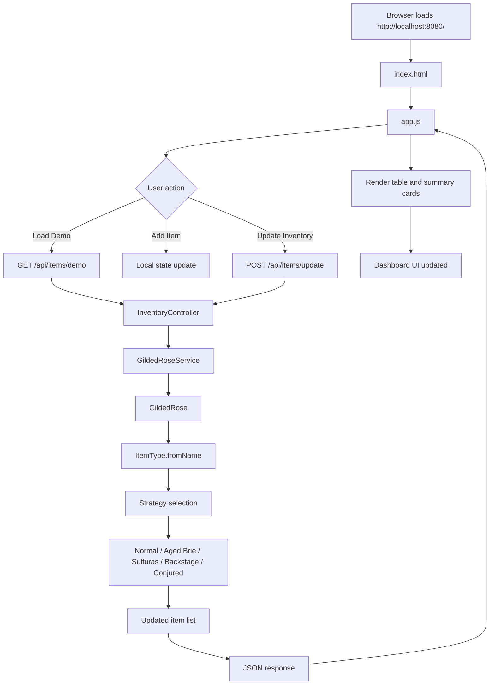
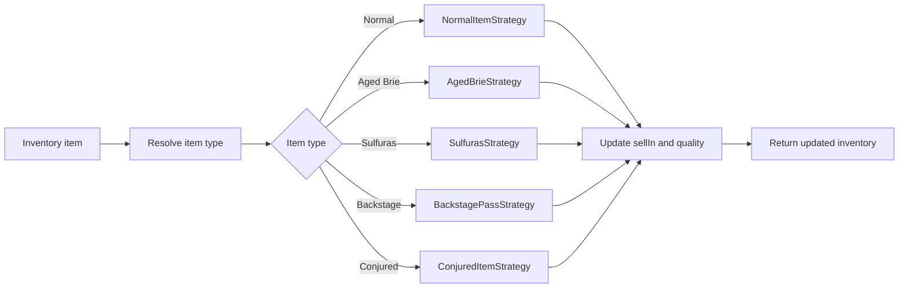

# Gilded Rose Web App Flow Map

## Where the dashboard code is implemented

### Frontend dashboard
- `WebApp/src/main/resources/static/index.html`
  - dashboard layout and HTML structure
- `WebApp/src/main/resources/static/styles.css`
  - dashboard styling and responsive design
- `WebApp/src/main/resources/static/app.js`
  - browser-side logic for loading inventory, updating values, and calling the API

### Spring Boot API
- `WebApp/src/main/java/com/gildedrose/webapp/controller/InventoryController.java`
  - REST endpoints for health, demo inventory, and update requests
- `WebApp/src/main/java/com/gildedrose/webapp/service/GildedRoseService.java`
  - service layer that processes inventory and delegates to the business logic
- `WebApp/src/main/java/com/gildedrose/webapp/service/GildedRose.java`
  - core inventory update engine
- `WebApp/src/main/java/com/gildedrose/webapp/domain/ItemType.java`
  - resolves item type and strategy selection
- `WebApp/src/main/java/com/gildedrose/webapp/quality/*.java`
  - strategy implementations for normal, aged brie, sulfuras, backstage, and conjured rules

---

## Browser to API flow

---

## API request flow in detail

### 1. Dashboard loads
- The browser requests `/`
- Spring Boot serves `index.html`
- `app.js` loads and initializes the UI

### 2. User loads demo data
- `app.js` calls `GET /api/items/demo`
- `InventoryController.demoInventory()` returns a sample inventory list
- The page renders it in a table and updates summary metrics

### 3. User edits inventory
- The UI lets the user update `sellIn`, `quality`, and add or delete items locally

### 4. User clicks Update Inventory
- `app.js` sends `POST /api/items/update` with the current JSON inventory
- `InventoryController.updateInventory()` accepts the list and validates it
- `GildedRoseService.updateInventory()` makes a defensive copy
- `GildedRose.updateQuality()` loops through each item
- `ItemType.fromName()` selects the correct strategy for the item type
- The specific strategy rule runs and updates `sellIn` and `quality`
- The final list is returned as JSON to the browser
- The dashboard refreshes the UI with the updated values

---

## Business rule execution path

---

## Summary

The dashboard is a thin client that calls a REST API. The real business logic remains in the Java backend, which keeps the architecture clean, testable, and aligned with SOLID principles.
